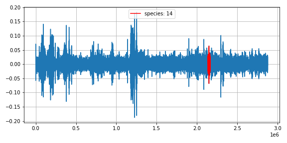

# Rainforest Connection Species Audio Detection

    

## Overview

The Rainforest Connection Species Audio Detection competition is currently live on Kaggle. The goal of the competition is to detect a variety of bird and frog species in a tropic soundscape recording. The competition database contains a series of acoustically complex, one-minute recordings containing at least one call of a known wildlife species. The database also includes true positive and false positive csv files that can be used to help train the detection model.

## Data Exploration

The dataset includes over 4,700 one-minute audio recordings that are designated for model training. Data from these recordings can be found in the train_tp (1,132 rows) and train_fp (3,958 rows) csv files. The csv files include detail about the recordings such as: recording_id, species_id, songtype_id, start and end time, and high and low frequencies. The test audio database is comprised of nearly 2,000 one-minute audio recordings. No labels are included for these recordings.

My analysis and model are based on only the true positive recordings and csv file. After cleaning the data I was left with 1,088 one-minute audio recordings. The graphs below summarize the metadata for these recordings.

    

    
    

Audio Classification is dependent on the features one can extract from audio data. For this project, I focused on analyzing Mel Spectrograms, which will be explained later. For now, we will start with the concept of sound.

Sound is basically a sequence of vibrations in varying pressure strengths. Loosely speaking, visualizing sound really means visualizing airwaves. A two-dimensional representation of a song can be expressed in a waveplot, which illustrates amplitude over time. Here are a few examples of waveplots from the dataset. The highlighted sections of the graphs illustrate the moment in time the species is heard in the audio clip. The last waveplot is an example of a clip with five distinct calls from four different species of animals.

    
    
    
    

    

Skipping ahead a few steps, we wind up with a spectrogram. A spectrogram is a visual representation of the spectrum of frequencies of a signal as it varies over time- showing which frequencies are active at a particular moment. A spectrogram transforms frequency to a log scale and amplitude to decibels. Further complicating things, the Mel Scale is the result of some non-linear transformation of the frequency scale. This Mel Scale is constructed such that sounds are of equal distance from each other on the Mel Scale. This is how humans hear "sound".

    
    
    

Recap:
The Mel Spectrogram is the result of the following pipeline:
1. Separate to windows
2. Compute the FFT (Fast Fourier Transform)
3. Generate a Mel scale
4. Generate a Spectrogram

    

Here are a few examples of Mel Spectrograms from the dataset:

    
    
    
    

These Spectrograms are great for computers to train on. Below is an example of true positive and false positive predictions on a Mel Spectrogram.

## Model

A detection model will need to identify true positive and false positive predictions from the audio clips. Here is an example of an audio clip with multiple true and false positives:

    

The model I used consists of three convultion blocks with a max pool layer in each of them. The model is activated by a relu activation function at each layer and uses a softmax activation function for multi-class classification. When compiling the model, I used the Adam optimizer and SparseCategoricalCrossentropy loss function. I passed the metrics argument to be able to view training and validation accuracy for each training epoch.

To reduce complexity, I trained the model using only true positive recordings. I reduced the audio clip dimensions so that only the true positive occured in the clip. Here is a comparison of images I used to train my model:

    

Model Summary:

    

Model Fit:

    

Training and Validation Scores:

    

Predicting on test data: The test data is a holdout from the train_tp dataframe.

    

Confusion Matrix

    

The model confused species 9 with species 0 twice. Audio examples from these two species can be found here.

## Future Steps

Random Forest on wavelengths
Incorporate false positives into test
Improve mel spectrogram images
Train model on full clip

Random Forest on wavelengths

Incorporate TP

Train model on full clip

[Rainforest Audio Detection](https://www.kaggle.com/c/rfcx-species-audio-detection/data)
